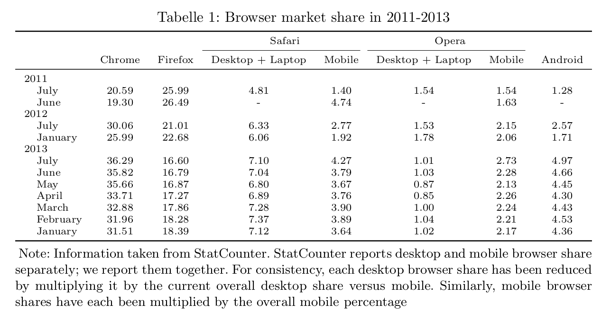

# tisch
*tisch* allows to convert R data frames into LaTeX tables. Presently, *tisch* provides three advantages over other packages with similiar ambition:

1. Intricate table designs: *tisch* can help you design tables that clearly communicate the hierarchical structure in your data.
2. Consistent API: *tisch* provides a succinct DSL for generating tables and manipulating table elements.
3. Theme-based: Aestethical changes to the table are excercised through a theming function. *tisch* allows (will allow) themes to be saved and reused for multiple tables.

## Installation 
Get the development version from Github: 


```r
# install.packages("devtools")
devtools::install_github("crubba/tisch")
```

## Using tisch
I illustrate the generation of a tisch table with an accompanying dataset of the *tisch* package:


```r
library("tisch")
data("browsershares")

tt <- tisch(browsershares, rows = c("Year", "Month"), sep = " >> ") +
  theme(
    row_style = ragged(indent = 0.2),
    column_justification = "central",
    text_size = "scriptsize",
    replace_NA = "-"
  ) + 
  caption("Browser market share in 2011-2013") +
  footnote("Note: Information taken from StatCounter. StatCounter reports desktop and mobile browser share separately; we report them together. For consistency, each desktop browser share has been reduced by multiplying it by the current overall desktop share versus mobile. Similarly, mobile browser shares have each been multiplied by the overall mobile percentage")

textab <- to_tex(tt)

write_tisch(x = textab, filename = "~/mycooltable.tex", full = T)
```



## Development & Disclaimer
More detailed information on *tisch* can be learned from the package [vignette](). *tisch* is in a very early development stage. Part of the API are likely to change in future versions. 
